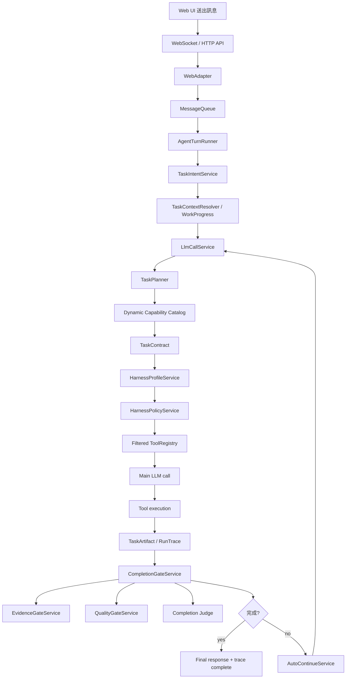

# OpenSprite Task Flow Guide

這份文件整理一則使用者訊息從 Web UI 進來，到 Agent 判斷任務、選工具、執行、檢查完成、寫 trace 的完整流程。

目標是讓你之後要調整 Task / Harness / Completion 相關邏輯時，可以照著這份文件一段一段看，不用每次重新摸整條線。

## 一頁版流程



## 先記住三個名詞

### TaskIntent

位置：`src/opensprite/agent/task_intent.py`

`TaskIntent` 只判斷「這回合使用者訊息的形狀」，例如：

- 是一般任務、問題、指令、媒體上傳，還是長任務
- 使用者原始目標文字是什麼
- 是否看起來需要後續驗證

它不應該判斷「要不要上網」、「要不要讀檔」、「要不要改 code」。這些語意判斷現在交給 Planner。

### TaskContract

位置：`src/opensprite/agent/task_contract.py`

`TaskContract` 是這一輪任務的完成契約。它會描述：

- 這輪任務需要哪類 evidence
- 哪些工具類型可能需要開放
- final answer 需要滿足什麼條件
- 是否需要驗證、來源、檔案變更、工作區證據

目前這裡是核心。要讓 agent 不要靠硬編碼誤判工具需求，主要就是看這段。

### WorkProgress

位置：`src/opensprite/agent/work_progress.py`

`WorkProgress` 是跨回合任務狀態。它處理：

- 目前 active task 是什麼
- 是否要建立或更新 plan
- 是否要把 unfinished task 接下去
- 完成後怎麼更新狀態

它比較像 session 狀態，不是工具選擇核心。

## 逐段看流程

### 1. Web UI 送出訊息

主要入口：

- `apps/web/src/composables/useChatClient.js`
- `src/opensprite/channels/web.py`
- `src/opensprite/channels/web_api.py`

前端送出訊息後，Web channel 會把訊息轉成後端可處理的 user message，再交給 queue。

要看 UI trace / debug export，主要看：

- `apps/web/src/components/RunTraceViewer.vue`
- `apps/web/src/components/RunSummaryCard.vue`
- `apps/web/src/components/MessageList.vue`

### 2. WebAdapter 丟進 MessageQueue

主要入口：

- `src/opensprite/channels/web.py`
- `src/opensprite/bus/dispatcher.py`

`MessageQueue` 在 `src/opensprite/bus/dispatcher.py`。它負責排隊、取消、處理 inbound/outbound message。

這段通常不應該放任務語意判斷。它只負責把訊息送進 Agent runtime。

### 3. AgentTurnRunner 接手一輪對話

主要入口：

- `src/opensprite/agent/turn_runner.py`

`AgentTurnRunner` 是一輪 user turn 的主控器。它會處理：

- media-only message
- audio pre-transcribe
- task intent classification
- pre-work context
- LLM call
- completion evaluation
- auto-continue
- final response / trace / curator

如果你想知道「一則訊息到底往哪裡跑」，先看這個檔案。

### 4. TaskIntentService 先做輕量分類

主要入口：

- `src/opensprite/agent/task_intent.py`

這裡只做穩定、便宜、低風險的分類。

應該保留在這裡的判斷：

- 空訊息
- slash command
- 是否帶 media
- 訊息是否很長

不應該放在這裡的判斷：

- 使用者是不是要上網
- 使用者是不是要讀 repo
- 使用者是不是要改檔案
- 使用者是不是需要 `web_search` 或 `grep_files`

這些應該交給 `TaskPlanner`。

### 5. TaskContextResolver / WorkProgress 補上下文

主要入口：

- `src/opensprite/agent/task_context_resolver.py`
- `src/opensprite/agent/work_progress.py`

這段會看目前 session 狀態，決定是否要延續 active task、更新 plan、或把前一輪未完成的工作接起來。

調整這裡時要小心，因為它會影響「同一個 session 的長上下文測試」。

### 6. LlmCallService 開始準備主 LLM 呼叫

主要入口：

- `src/opensprite/agent/llm_call.py`

`LlmCallService.call_llm()` 會做幾件重要事情：

- 建立或取得 `TaskContract`
- 根據 contract 選 harness profile
- 根據 profile / policy 過濾工具
- 建立 system/user/tool prompt
- 呼叫主 LLM
- 執行模型提出的 tool calls
- 收集 execution result

如果你要看「主對話到底送了什麼工具給 LLM」，這裡是主入口。

### 7. TaskPlanner 讓 LLM 判斷任務契約

主要入口：

- `src/opensprite/agent/task_contract.py`
- `src/opensprite/agent/planner_capabilities.py`

目前流程是：

1. `TaskPlanner.plan()` 收到 `TaskIntent`、目前訊息、history、媒體資訊、tool registry。
2. `build_planner_capability_catalog()` 從目前註冊的工具動態建立 capability catalog。
3. Planner prompt 把能力清單交給 LLM。
4. LLM 回 JSON。
5. `_contract_from_task_planner_payload()` 把 JSON 正規化成 `TaskContract`。

重點：

- Planner 不應該硬寫死每個工具。
- 新工具應該透過 tool registry / capability catalog 被 Planner 看見。
- Planner 決定的是「任務契約」，不是直接執行工具。
- 真正要不要 call 某個工具，還是主 LLM 在拿到可用工具後自己決定。

### 8. HarnessProfile / HarnessPolicy 套工具權限

主要入口：

- `src/opensprite/agent/harness_profile.py`
- `src/opensprite/agent/harness_policy.py`
- `src/opensprite/tools/registry.py`

Contract 會推導出 harness profile，例如 chat / research / coding / media / ops。

接著 policy 會決定：

- 這類任務可見哪些工具
- 哪些風險等級要 approval
- 哪些工具即使註冊了也不能給主 LLM

這裡的重點是「權限集中管理」。不要在各處散落工具開關。

### 9. 主 LLM 自己決定要不要用工具

主要入口：

- `src/opensprite/agent/llm_call.py`
- `src/opensprite/tools/`

主 LLM 會看到被 policy 過濾後的工具 schema。它可以選擇：

- 直接回答
- 呼叫 `web_search` / `web_fetch` / `web_research`
- 呼叫 workspace 工具如 `grep_files` / `read_file`
- 呼叫 verify / media / cron / delegate 等工具

Planner 決定「需要什麼 evidence」，主 LLM 決定「實際用哪個工具拿 evidence」。

### 10. 工具結果變成 TaskArtifact 和 trace

主要入口：

- `src/opensprite/agent/task_artifact.py`
- `src/opensprite/runs/`
- `apps/web/src/components/RunTraceViewer.vue`

工具執行結果會被整理成 execution result。可追蹤的 web source、file change、verification result 等會成為 task artifacts。

Trace 裡常看的內容：

- tool call 有沒有發生
- tool result 是否成功
- artifact 是否被記錄
- completion gate 為什麼判定 complete / incomplete / blocked
- auto-continue 是否啟動

### 11. CompletionGate 判斷是否完成

主要入口：

- `src/opensprite/agent/completion_gate.py`
- `src/opensprite/agent/evidence_gate.py`
- `src/opensprite/agent/quality_gate.py`
- `src/opensprite/agent/completion_judge.py`

Completion 不是只看模型有沒有回一句話。

它會綜合：

- `CompletionJudgeService`：LLM judge 判斷回答是否完成
- `EvidenceGateService`：contract 要的 evidence 是否真的有
- `QualityGateService`：回答品質、來源引用、工作區 grounding 是否合理

如果使用者要上網，但 trace 沒有有效 web evidence，這裡應該擋下來。

如果使用者要看 repo，但 final answer 引用了沒有從工具輸出看到的檔案或函式，這裡也應該擋下來。

### 12. AutoContinue 負責補跑，不是硬回覆

主要入口：

- `src/opensprite/agent/auto_continue.py`

如果 completion gate 判斷 incomplete，`AutoContinueService` 會產生下一輪 retry prompt，要求 agent 補缺的 evidence 或修正回答。

它不應該把「讓我繼續查」這類進度句直接丟給使用者當 final answer。

## 要調整時的建議順序

### 想調整「任務怎麼被判斷」

先看：

1. `src/opensprite/agent/task_intent.py`
2. `src/opensprite/agent/task_contract.py`
3. `src/opensprite/agent/planner_capabilities.py`
4. `tests/agent/test_task_contract_policy.py`

原則：

- `TaskIntent` 只留訊息形狀分類。
- 語意判斷交給 `TaskPlanner`。
- Planner 能力清單要從工具註冊動態產生。

### 想調整「工具權限」

先看：

1. `src/opensprite/agent/harness_policy.py`
2. `src/opensprite/agent/harness_profile.py`
3. `src/opensprite/tools/registry.py`
4. `src/opensprite/config/`

原則：

- 不要在 `llm_call.py` 或某個 tool 裡偷塞權限判斷。
- 權限與 approval mode 要集中。
- 設定要吃 config，不要硬編碼散落。

### 想調整「為什麼沒繼續跑」

先看：

1. `src/opensprite/agent/completion_gate.py`
2. `src/opensprite/agent/evidence_gate.py`
3. `src/opensprite/agent/quality_gate.py`
4. `src/opensprite/agent/auto_continue.py`

原則：

- 先看 trace 裡 completion reason。
- 再看 missing_evidence。
- 最後才改 auto-continue prompt。

### 想調整「trace debug 看不到」

先看：

1. `src/opensprite/runs/`
2. `src/opensprite/agent/task_artifact.py`
3. `apps/web/src/components/RunTraceViewer.vue`
4. `apps/web/src/components/RunSummaryCard.vue`

原則：

- 後端 trace payload 要先有資料，前端才顯示得出來。
- 新增 trace 欄位時，要同時考慮 debug export。

## 測試流程

### Focused Python tests

```powershell
python -m pytest tests/agent/test_task_contract_policy.py tests/agent/test_harness_profile.py
python -m pytest tests/agent/test_tool_access.py tests/agent/test_tool_registration.py
python -m pytest tests/agent/test_completion_gate.py tests/agent/test_auto_continue.py
```

### 前端 smoke / build

```powershell
Set-Location apps\web
npm.cmd run test:smoke
npm.cmd run build
Set-Location ..\..
```

### 單次 CLI 流程測試

```powershell
python -m opensprite chat --json --session-id cli:task-flow-smoke --timeout 180 "幫我找一下目前 repo 裡 TaskPlanner 是在哪裡定義的，回答檔案與行號。"
```

回傳 JSON 裡會有 `run_id`。拿到後看 trace：

```powershell
python -m opensprite trace <run_id> --session-id cli:task-flow-smoke --json
```

### 同一 session 長上下文測試

重點是固定同一個 `--session-id`，不要每次產生新的 session。

```powershell
python -m opensprite chat --json --session-id cli:long-context-task-flow --timeout 180 "第一題：請先說明 OpenSprite 的 task flow。"
python -m opensprite chat --json --session-id cli:long-context-task-flow --timeout 180 "第二題：延續剛剛，請找出 CompletionGate 的主要檔案。"
python -m opensprite chat --json --session-id cli:long-context-task-flow --timeout 180 "第三題：延續同一個 session，請說明如果 web research 沒有 source evidence，哪一層應該擋下。"
```

每一題都拿 `run_id` 查 trace。

## Trace 檢查清單

每次測試至少看這些欄位或事件：

- `task_intent` 是否只是任務形狀，不是工具判斷
- `task_contract` 是否有合理 task type / required evidence
- `harness_profile` 是否符合任務
- `toolCalls` 是否跟任務相符
- `task_artifacts.recorded` 是否記錄到來源、檔案、驗證等 evidence
- `completion.status` 是否是 `complete`、`incomplete` 或 `blocked`
- `completion.missing_evidence` 是否有指出缺什麼
- `auto_continue` 是否有在 incomplete 時補跑
- final answer 是否引用 trace 裡真的存在的 evidence

## 常見問題對照

### Agent 只回「我繼續查」就停了

先看：

- `completion_gate.py`
- `auto_continue.py`
- trace 的 `completion.progress_only_response`

預期行為：

- 這類進度句不能當完成答案。
- 應該進入 auto-continue 或明確 blocker。

### User 要上網，但工具被擋

先看：

- `task_contract.py`
- `harness_policy.py`
- trace 裡的 `task_contract` / `harness_profile` / tool access result

預期行為：

- Planner 應該判斷需要 web evidence。
- Policy 應該讓 web read/search 類工具可用，除非 config 明確關閉。

### User 要找 repo 內容，但回答憑空說檔案或函式

先看：

- `llm_call.py`
- `quality_gate.py`
- `tests/agent/test_llm_call_guidance.py`

預期行為：

- 回答只能引用工具輸出看過的檔名、行號、symbol。
- 不確定的 symbol 要先用工具確認。

### 新工具加了，但 Planner 不知道

先看：

- `src/opensprite/tools/base.py`
- `src/opensprite/tools/registry.py`
- `src/opensprite/agent/planner_capabilities.py`

預期行為：

- 工具要有清楚 `name`、`description`、`parameters`。
- 如有需要，補 `capability_groups`。
- Planner capability catalog 應該動態帶到 prompt。

## 最安全的修改節奏

1. 先用 trace 找出錯在哪一層。
2. 只改一小段。
3. 跑 focused tests。
4. 跑一次 CLI flow。
5. 查該 run 的 trace。
6. 確認沒有新問題再 commit。

不要一次同時改 Planner、Policy、Completion、AutoContinue。這幾層互相影響，分開改比較容易知道是哪一層造成行為改變。
